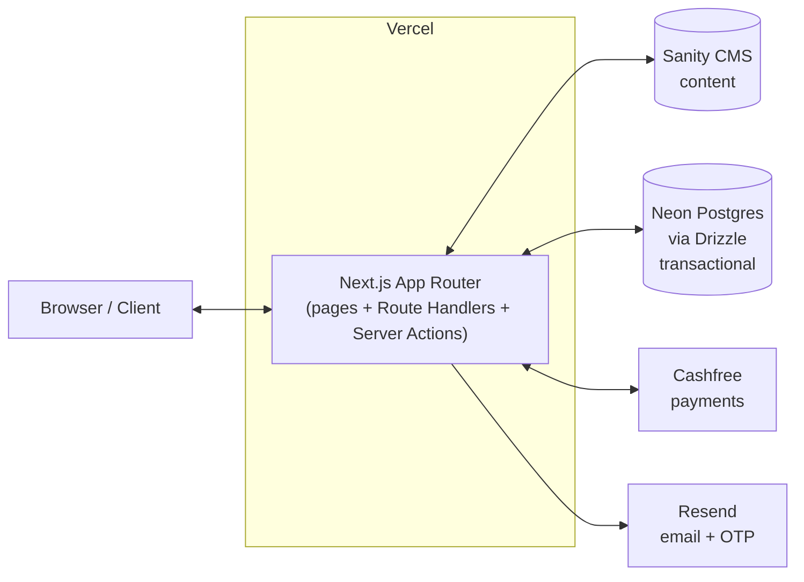
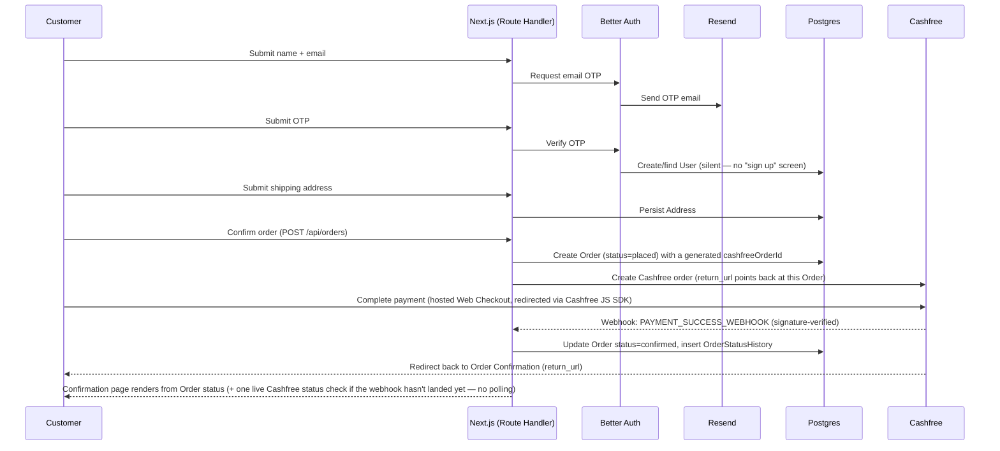
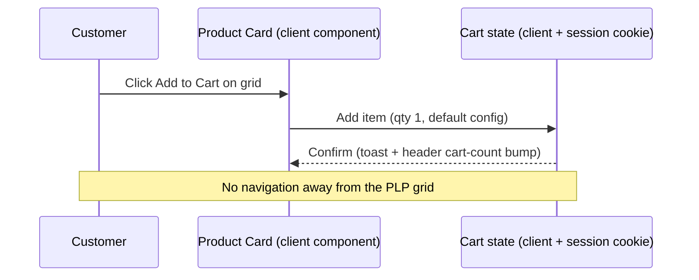

# Architecture — Tanvira

**Version:** 1.0
**Date:** August 29, 2026
**Status:** Draft

Tanvira is a **single Next.js application** — there is no separate frontend/backend split. Pages (App Router) and API logic (Route Handlers + Server Actions) live in one codebase and deploy as one Vercel project. "Backend" below means the Route Handlers/Server Actions inside this same app, not a separate service.

---

## System Diagram



**Why one app, two data stores:** Sanity is optimized for editorial content the owner touches by hand (products, banners, promo *definitions*) and isn't built for high-write transactional data. Orders, payments, and promo *redemptions* need consistency guarantees Sanity doesn't offer, so they live in Postgres via Drizzle. See [DB_SCHEMA.md](./DB_SCHEMA.md) for the full data model.

**Cost baseline:** Vercel, Neon, Sanity, and Resend free tiers plus Cashfree's per-transaction-only fee mean v1 has $0 fixed monthly cost.

---

## Module Breakdown

Since there's no FE/BE split, the app tree is organized by concern within one Next.js project:

```
app/
├── (storefront)/                     # Pages — one route per DESIGN.md screen
│   ├── page.tsx                      # Landing
│   ├── products/page.tsx             # PLP
│   ├── products/[slug]/page.tsx      # PDP
│   ├── cart/page.tsx
│   ├── checkout/page.tsx             # 3-step flow, client-side step state
│   ├── orders/[id]/page.tsx          # Order Status
│   ├── orders/[id]/confirmation/page.tsx
│   ├── account/orders/page.tsx       # Order History
│   ├── login/page.tsx                # Email OTP login
│   ├── legal/[slug]/page.tsx         # Privacy / Terms / Shipping & Returns
│   ├── not-found.tsx                 # 404
│   └── error.tsx                     # 500
├── api/                               # Route Handlers — the "backend"
│   ├── checkout/create-account/route.ts
│   ├── orders/route.ts
│   ├── orders/[id]/route.ts
│   ├── promo/validate/route.ts
│   ├── webhooks/cashfree/route.ts
│   └── auth/[...all]/route.ts        # Better Auth handler
└── studio/[[...tool]]/page.tsx        # Embedded Sanity Studio
components/
├── ui/                                 # shadcn primitives (Button, Input, Dialog, …)
└── storefront/                         # ProductCard, CartLineItem, OrderStatusTimeline, CheckoutSteps, …
lib/
├── sanity/                             # client, GROQ queries, image URL builder
├── db/                                 # Drizzle schema + client (see DB_SCHEMA.md)
├── auth/                               # Better Auth config, email-OTP plugin wiring
├── payments/                           # Cashfree client + webhook signature verification
└── email/                              # Resend client + React Email templates
drizzle/                                 # Postgres migrations (see DB_SCHEMA.md § Migration Order)
sanity.config.ts
```

- **Pages** (`app/(storefront)`) are the presentation layer — Server Components fetching from Sanity/Postgres directly where possible, Client Components for interactive bits (cart quantity steppers, checkout form state, OTP input).
- **Route Handlers** (`app/api/**`) are the "backend" — used specifically where a Server Component can't do the job directly: mutations that need webhook-style external callers (Cashfree), Better Auth's own handler, and anything TanStack Query needs to poll/mutate from the client.
- **`components/storefront`** maps 1:1 to the Component Catalogue in [DESIGN.md](./DESIGN.md).

---

## Data Flow

### Checkout → Payment → Confirmation



### PLP Quick Add to Cart



---

## Security Model

- **Authentication:** Better Auth, email-OTP plugin only for v1 — no passwords anywhere in the system. A session is established after OTP verification and reused for both checkout-triggered account creation and the returning-customer login flow ([DESIGN.md](./DESIGN.md) Flow 2).
- **Authorization:** Two roles — Customer (session-scoped access to their own Orders/Addresses/Order History only) and Owner (Sanity Studio access, managed by Sanity's own project-member auth, not Better Auth). No admin role exists inside the Next.js app itself; the owner never logs into the storefront as a privileged user.
- **Webhook integrity:** `POST /api/webhooks/cashfree` must verify the `x-webhook-signature`/`x-webhook-timestamp` headers against the raw request body before trusting any payload; an Order's status only advances to `confirmed`/`refunded` after this verification succeeds (see [PRD.md](./PRD.md) § Feature List, Payments row).
- **Input validation:** Zod schemas at every Route Handler and Server Action boundary — see [API_SPEC.md](./API_SPEC.md) for the request contracts being validated.
- **Secrets management:** Cashfree keys, Better Auth secret, Resend API key, and the Postgres connection string are Vercel environment variables, never committed; `.env.example` documents required keys without values.
- **PII handling:** phone number is stored only as a delivery-contact field on `Address` (never used for auth); email is the sole identifier tied to a `User`.

---

## Deployment Topology

| Environment | Host                          | Notes                                                                 |
| ------------- | -------------------------------- | -------------------------------------------------------------------------- |
| Production    | Vercel (Next.js app)              | Auto-deploys from `main`; env vars for Cashfree (production keys, `CASHFREE_ENV=production`), Sanity, Neon, Resend, Better Auth secret |
| Preview        | Vercel (per-PR preview deploys)   | Uses Cashfree sandbox keys (`CASHFREE_ENV=sandbox`) and a separate Neon branch/database          |
| CMS            | Sanity (managed, hosted Studio)   | Same project across environments; content is not environment-branched for v1 |
| Database       | Neon (Postgres, serverless)       | Free tier; branch-per-environment supported natively by Neon               |
| Email          | Resend                            | Free tier (3,000 emails/month) covers OTP + transactional email for v1     |
| Payments       | Cashfree                          | Sandbox mode in preview, production mode in production; payment/refund webhook URL registered per environment; incident status is checked live via API, not webhook |

**Scaling notes:** v1 is intentionally not architected for scale it doesn't have — no queue, no separate worker process, no caching layer beyond Next.js's built-in ISR for product pages. The split between Sanity (content) and Postgres (transactions) is the one deliberate scaling decision made up front, since retrofitting that split later would require a data migration under live order traffic.
