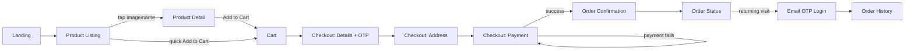

# Design Document — Tanvira

**Version:** 1.0
**Date:** August 29, 2026
**Status:** Draft

---

## 1. Design Principles
- **Quiet luxury** — generous whitespace, restrained ornamentation, let product photography carry the page
- **Fashion jewellery, not fine jewellery** — Tanvira sells mass-market imitation jewellery (gold-plated brass, artificial stones); copy and imagery must never imply genuine precious metals/gemstones, and accessible pricing supports frequent, low-consideration purchases
- **Frictionless commerce** — every extra tap between "want it" and "bought it" is a bug, especially at checkout — including on the listing page itself: quick Add to Cart from every product card, no forced detour through the PDP
- **Mobile-first** — most gifting/everyday-wear shoppers browse and buy from a phone
- **Owner-editable, not owner-breakable** — CMS content types are structured so the owner can't accidentally break page layout
- **Accessible by default** — jewellery photography needs strong contrast for text overlays; never sacrifice legibility for aesthetics

---

## 2. Design Tokens

### Color Palette
Derived from the Tanvira logo (burgundy background, cream wordmark, gold diamond mark). The storefront itself uses a light beige base so product photography reads clearly, with burgundy and gold as accent colors — the logo's dark palette is reserved for the header/footer and brand moments.

| Token | Hex | Usage |
|-------|-----|-------|
| `--color-primary` | `#5B0E22` (burgundy) | CTA buttons, links, active states |
| `--color-secondary` | `#C8A24C` (gold) | Accents, badges, dividers, hover underlines |
| `--color-background` | `#F7F1E8` (beige) | Page background |
| `--color-surface` | `#FFFDF8` (warm off-white) | Cards, modals, product tiles |
| `--color-text-primary` | `#2A1015` (deep burgundy-black) | Body copy, headings |
| `--color-text-secondary` | `#7A6A5D` (warm taupe) | Captions, meta text, secondary labels |
| `--color-error` | `#B3261E` | Errors, destructive actions (e.g. remove from cart) |
| `--color-success` | `#3F6E4E` | Order confirmed, payment success states |
| `--color-header-bg` | `#5B0E22` (burgundy) | Header/footer, matching the logo's native background |
| `--color-header-text` | `#F4E8D3` (cream) | Text/icons on the burgundy header/footer |

### Typography
| Token | Font | Size | Weight | Usage |
|-------|------|------|--------|-------|
| `--font-heading-xl` | Playfair Display (serif) | 40–56px | 500–600 | Hero, page titles — echoes the logo's serif wordmark |
| `--font-heading-lg` | Playfair Display | 24–32px | 500 | Section headers, product name on PDP |
| `--font-body` | Inter | 15–16px | 400 | Body copy, product descriptions, form labels |
| `--font-caption` | Inter | 12–13px | 400, letter-spacing 0.05em | Labels, tags, order status pills — mirrors the tagline's spaced-out caps treatment |

### Spacing & Radius
- Base unit: 4px (scale: 4, 8, 12, 16, 24, 32, 48, 64)
- Border radius: `--radius-sm` 4px (inputs, badges), `--radius-md` 8px (cards, buttons), `--radius-lg` 16px (modals, hero panels)

---

## 3. Screen Inventory

| Screen               | Route                     | Description                                                        | Key Components                                                    |
| --------------------- | -------------------------- | -------------------------------------------------------------------- | -------------------------------------------------------------------- |
| Landing                | `/`                         | Hero, featured collections, bestsellers, brand story                | Header Nav, Hero banner, Product Card, Footer                        |
| Product Listing (PLP)  | `/products`                 | Filterable/sortable catalog grid                                     | Filter Rail, Product Card (with quick Add to Cart), Skeleton         |
| Product Detail (PDP)   | `/products/[slug]`          | Gallery, rich-text description, bundle contents, Add to Cart         | Image Gallery, Rich Text Renderer, Product Card ("you may also like") |
| Cart                   | `/cart`                     | Line items, promo code, subtotal/discount/total                      | Cart Line Item, Promo Code Input, Button                              |
| Checkout — Step 1      | `/checkout`                 | Name + email, OTP verification                                       | Input (OTP segmented), Checkout Steps, Button                         |
| Checkout — Step 2      | `/checkout`                 | Shipping address (phone as contact field)                            | Input, Checkout Steps                                                 |
| Checkout — Step 3      | `/checkout`                 | Order summary, Cashfree payment trigger                              | Checkout Steps, Promo Code Input, Button                              |
| Order Confirmation     | `/orders/[id]/confirmation` | Order ID, summary, delivery estimate                                  | Status Badge, Button                                                  |
| Order Status           | `/orders/[id]`              | Status timeline, items, address, payment summary                     | Order Status Timeline, Status Badge, Breadcrumb                       |
| Order History          | `/account/orders`           | Logged-in customer's past orders (OTP-gated)                          | Status Badge, Breadcrumb                                              |
| Login / OTP            | `/login`                    | Email entry → OTP verification for returning customers                | Input (OTP segmented), Button                                         |
| Privacy Policy         | `/legal/privacy`            | Static/CMS legal copy                                                 | Rich Text Renderer                                                    |
| Terms of Service       | `/legal/terms`              | Static/CMS legal copy                                                 | Rich Text Renderer                                                    |
| Shipping & Returns     | `/legal/shipping-returns`   | Static/CMS policy copy                                                | Rich Text Renderer                                                    |
| 404 Not Found          | `/not-found`                | Branded fallback for unknown routes                                    | Button (home link)                                                    |
| 500 Server Error       | `/error`                    | Branded fallback for unhandled errors                                  | Button (retry/home link)                                              |
| Offline                | (client-side, no route)     | Shown when network is unavailable                                      | Button (retry)                                                        |

---

## 4. User Flows

### Flow 1: Browse → Purchase (primary flow)



**Notes:**
- Add to Cart works two ways: a quick-add button directly on every Product Listing card (default configuration, qty 1, no navigation away from the grid), or from the PDP after reviewing full details — both land in the same Cart.
- No account/sign-up screen exists as a separate step. The moment the customer submits name + email at checkout and verifies the OTP, Better Auth silently creates the account in the background; the customer only ever sees "checkout," never "sign up."
- Auth is email-only for v1 (keeps the stack free — no SMS provider needed). The OTP is sent and verified via Resend before payment, since it's the account identifier.
- Phone number is still collected, but on the Address step, purely as a delivery-contact field — it does not gate checkout and isn't used for login.
- Promo code entry sits on the Cart page, re-appliable at Checkout.

### Flow 2: Returning Customer — View Order Status
```
Landing/Header → "Track Order / Login" → Enter email
   → OTP sent (via Resend) → OTP verified → Order History → Order Status detail
     ↓ (wrong OTP)
   Retry / resend OTP (rate-limited)
```
**Notes:** Same Better Auth email-OTP mechanism as checkout — there is only one auth system, just two entry points (checkout auto-creates, header login re-authenticates).

### Flow 3: Owner — Manage Catalog (CMS)
```
Sanity Studio login → Products → Create/Edit product
   → Write rich-text description (material, size/length, care details), set images, price, bundle toggle
   → Publish → Reflected on storefront via ISR/revalidation
```
**Notes:** Studio uses Sanity's default UI (no custom admin build) to keep this fast to ship and free to maintain.

---

## 5. Screen Descriptions / Wireframe Notes

### Screen: Landing
**Purpose:** First impression, brand tone-setting, route into collections
**Key elements:**
- Hero banner (owner-editable via CMS: image, headline, CTA link)
- Featured/curated collection strip (e.g. "Gifting Edit," "Everyday Wear")
- Bestsellers or new-arrivals grid
- Brand story strip (short, optional CMS block)
- Footer: contact/WhatsApp, socials, policies

**States:** Default | Loading (skeleton banner + cards) | Error (fallback static hero if CMS fetch fails)

### Screen: Product Listing (PLP)
**Purpose:** Browse and filter the catalog
**Key elements:**
- Category filter, price range filter
- Product grid (image, name, price, **Add to Cart button on every card** for quick-add — mass-market imitation-jewellery pricing means most purchases don't need a PDP detour; tapping the image/name still opens the PDP for full details)
- Sort (price, newest)

**States:** Default | Loading (skeleton grid) | Empty (no matches — "no items in this filter") | Error
**Notes:** Quick Add to Cart adds the default configuration (qty 1) and confirms inline (e.g. toast + header cart-count bump) without navigating away from the grid.

### Screen: Product Detail (PDP)
**Purpose:** Convert interest into an add-to-cart
**Key elements:**
- Image gallery
- Name, price
- Rich-text description (renders CMS-authored content: material, size/length, care instructions — all part of the same content block, no separate selector UI)
- Bundle contents list (if product is a bundle)
- Add to Cart CTA (sticky on mobile)
- Stock status

**States:** Default | Loading | Out of stock (CTA disabled, "Notify me" optional post-v1) | Error

### Screen: Cart
**Purpose:** Review and adjust items before checkout
**Key elements:**
- Line items with quantity stepper, remove
- Promo code input
- Subtotal, discount, total
- "Proceed to Checkout" CTA

**States:** Default | Empty ("Your cart is empty" + browse CTA) | Loading (on quantity update) | Error (invalid promo code messaging)

### Screen: Checkout
**Purpose:** Single-flow conversion — details, address, payment
**Key elements:**
- Step 1: Name + Email + OTP verification (auto-creates account on submit)
- Step 2: Shipping address (includes phone as a plain contact field)
- Step 3: Order summary + Cashfree payment trigger
- Promo code re-entry point

**States:** Default | Loading (during OTP send / payment processing) | Error (OTP invalid, payment failed — both must offer a clear retry) | Success (redirects to Order Confirmation)

### Screen: Order Confirmation
**Purpose:** Reassure the customer the order succeeded, give a reference point
**Key elements:**
- Order ID, summary, delivery address, estimated timeline
- Link to Order Status page
- "We've emailed/texted your confirmation" note

**States:** Default | Error (payment succeeded but confirmation fetch failed — show order ID with a manual "view order" link/support contact)

### Screen: Order Status
**Purpose:** Let a customer check where their order is
**Key elements:**
- Status timeline: Placed → Confirmed → Shipped → Delivered (or Cancelled / Refunded as terminal states)
- Order items, address, payment summary
- Support/contact CTA for issues

**States:** Default | Loading | Error (order not found)

### Screen: Order History (Account)
**Purpose:** Logged-in customer's past orders
**Key elements:**
- List of past orders (date, status, total, link to detail)
- OTP-based login gate before this screen is reachable

**States:** Default | Empty (no past orders) | Loading | Error

### Screen: Login / OTP
**Purpose:** Passwordless re-entry point for returning customers
**Key elements:**
- Email input, "Send OTP" CTA
- 6-digit segmented OTP input, resend (rate-limited)

**States:** Default | Loading (sending/verifying) | Error (invalid/expired OTP, rate-limited)

### Screen: Legal & Policy Pages (Privacy, Terms, Shipping & Returns)
**Purpose:** Static compliance/policy copy, linked from the footer
**Key elements:**
- Title, last-updated date, rich-text body

**States:** Default only — no CMS-dependent loading/error states for launch (copy can be hardcoded or CMS-authored later)

### Screen: System States (404, 500, Offline)
**Purpose:** Branded fallback instead of a default framework error screen
**Key elements:**
- Short message matching brand voice, illustration/icon, primary action (home link for 404/500, retry for Offline)

**States:** Each is itself a single state — no further loading/empty/error variants apply

---

## 6. Responsive & Mobile Considerations

| Breakpoint | Width | Layout notes |
|------------|-------|--------------|
| Mobile | < 640px | Single-column PLP/cart, sticky "Add to Cart" / "Pay Now" CTA bar, bottom-anchored primary actions, hamburger nav |
| Tablet | 640–1024px | 2-column PLP grid, cart as slide-over drawer |
| Desktop | > 1024px | 3–4 column PLP grid, cart as slide-over drawer, top nav with category links |

- Navigation: horizontal top nav (burgundy header) on tablet/desktop; hamburger + bottom sticky CTA on mobile
- Touch target minimum: 44×44px on all interactive elements
- Checkout steps stack vertically on mobile with clear step indicators — no multi-column forms below 640px
- Product image galleries: swipeable carousel on mobile, thumbnail strip on desktop

---

## 7. Interaction & Animation Notes

- **Hover states:** Buttons and Product Cards lift with a subtle shadow (effect style `card`) on hover (desktop only — no hover-dependent functionality, since mobile has no hover).
- **Quick Add to Cart feedback:** clicking the PLP card's Add to Cart pill triggers an inline toast ("Added to cart") plus a brief scale/bounce on the header cart-count badge — no page navigation or modal interrupts the browsing flow.
- **Transitions:** page-to-page navigation uses Next.js's default route transitions (no custom page-transition animation for v1); Cart quantity changes animate the subtotal/total number rather than jump-cutting.
- **Empty states:** Cart-empty and Order-History-empty both pair a short message with a single "Browse products" CTA — never a dead end.
- **Error states:** inline, next to the field/section that failed (promo code error under the input, OTP error under the OTP field) rather than a global banner, so the customer doesn't lose context on a long checkout form.
- **Loading states:** skeleton loaders (not spinners) for PLP grid, PDP, and cart, matching the final layout's shape to avoid content jump when data arrives.

---

## 8. Accessibility Requirements
- **WCAG level target:** AA
- Color contrast: burgundy-on-beige and cream-on-burgundy combinations to be verified at 4.5:1 minimum for body text, 3:1 for large text (gold accent is decorative only — never used for text needing contrast guarantees)
- All interactive elements keyboard-navigable, including cart quantity steppers, and rich-text description content must use proper heading/list semantics (not just visual styling) for screen readers
- Screen reader support: semantic HTML, `aria-label`s on icon-only buttons (cart, remove, filter toggles)
- Focus indicators: visible focus ring using `--color-secondary` (gold) on all focusable elements
- Alt text required for all product and banner images (enforced as a required CMS field in Sanity schema, not just a convention)
- Order status timeline must be readable by screen readers as a sequence, not just visually implied by icon position

---

## 9. API / Data Contracts

→ See [API_SPEC.md](./API_SPEC.md) for the full, authoritative endpoint contracts (request/response fields, auth, error codes, pagination). This section previously duplicated that detail; kept out here to avoid drift between the two files.

---

## 10. Component Catalogue

| Component              | Purpose                                                        | Variants / States                                                        |
| ------------------------ | ------------------------------------------------------------------ | ---------------------------------------------------------------------------- |
| Button                    | Primary action trigger across the app                               | primary (burgundy), secondary (outline), ghost, destructive; default/hover/disabled |
| Input                     | Text entry                                                          | text, phone (contact-only, non-auth), OTP (6-digit segmented); default/focus/error/disabled |
| Header Nav                | Global top navigation                                               | burgundy background, logo, cart icon with count, login/account link          |
| Footer                    | Global footer                                                       | links, contact/WhatsApp, socials, policy links                               |
| Status Badge / Pill       | Order-state indicator, color-coded                                  | Placed, Confirmed, Shipped, Delivered, Cancelled, Refunded                    |
| Order Status Timeline     | Sequential order-state stepper                                      | horizontal (desktop) / vertical (mobile)                                     |
| Checkout Steps            | Progress indicator across the 3-step checkout                       | Current Step = 1, 2, 3 (circle + connector, matches Order Status Timeline)   |
| Product Card              | Catalog tile — image, name, price, badge, **quick Add to Cart pill** | default, bundle badge, sale badge                                            |
| Cart Line Item            | A single cart row with quantity stepper and remove                  | default, low-stock                                                           |
| Promo Code Input          | Code entry with apply/remove                                        | default, applied, error (invalid/expired code)                               |
| Rich Text Renderer        | Sanity Portable Text → styled content block                         | used on PDP description, legal pages                                         |
| Modal / Dialog            | Overlay for confirmations and secondary flows                       | default                                                                       |
| Toast / Notification      | Transient feedback (order placed, promo applied, errors)            | success, error, info                                                         |
| Breadcrumb                | Secondary navigation trail                                          | 2-level, 3-level                                                              |
| Image Gallery / Carousel  | Product imagery                                                     | swipeable (mobile), thumbnail strip (desktop)                                |
| Skeleton                  | Loading placeholder                                                 | PLP grid, PDP, cart                                                          |
| Filter Rail               | PLP category/price filtering                                        | default, active filter chips                                                 |
- [ ] Promo Code Input (with apply/remove state)
- [ ] Modal / Dialog
- [ ] Toast / Notification (order placed, promo applied, errors)
- [ ] Header Nav (burgundy, logo, cart icon with count, login/account)
- [ ] Footer (links, contact, socials)
- [ ] Image Gallery/Carousel (PDP)
- [ ] Skeleton loaders (PLP grid, PDP, cart)

---

## 11. Open Design Questions
- Exact CMS-editable fields for the homepage hero (single hero vs. rotating carousel?)
- Portable Text schema for the description field — which block types/styles the owner needs (headings, bullet lists for "care instructions" vs. "specifications") without overcomplicating the editor
- Final choice of secondary sans font pairing for body text (Inter proposed, not yet confirmed against brand)
